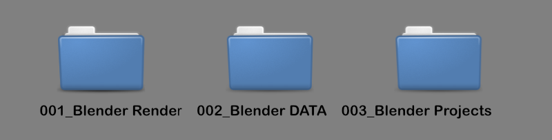
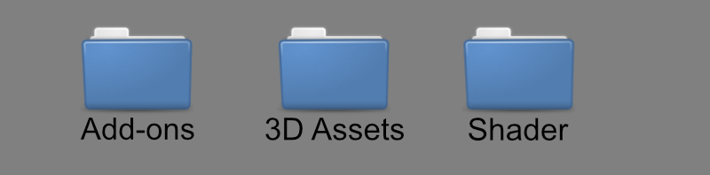

# INTRO

Organizing our Data is impotent our digital world, we are unable to memorize every note or filename or 3D asset that we have. We have projects with 10 or 50 objects in our Scene. if you have a specific Asset in mind  that you really wanna use, and you can't find it because the file you saved in is a mess with 3D objects, Project Files, pictures all in one Folder is not very productive and efficient. Workflow is the key of productivity.
If we have a standard in our system we have  efficiency as a result. no need to think about how we start all over again. the structure is there and we can just use is instead building it from the ground up every time. there are already Systems like the <u>P.A.R.A Method by Tiago Forte</u>. My notes are based on the P.A.R.A Method but I changed it here and there for my Style.

Here is are a blueprint of how I  structure my Folder and Files as a 3D-Artist and some tips and tricks.
of cause every person is different and has different sense order and System. this here is how I do it and is just a inspiration of how will you do it. in this example I use **Windows and Blender**. but can be transfer to Linux, MAC and other Software.
# 1. Structure Folder
![[Slice1.png]]
This here is a picture of my external SDD. I numbered them because you can sort them by numbers descending. the folders will appear on the top of the file manager. so I have quick access every time i open my Drive. I made a folder for finished renders of my projects image sequences, videos all renders. Blender `DATA` Folder is where all my 3D assets, Materials, addons are. Blender `Projects` is where all my Blender scenes and Projects are.
started and finished projects.
 - Blender Projects will appear in the render folder with the same name.
 - For every new blender scene I create a new folder

___
 
_____
My Blender DATA folder has it's own addons folder where I put every installed addon in a folder.
I put Shader in a folder and 3D assets in a folder too
# 2. Assetmanagement

Managing Asset for later use is  key of efficiency. to organize them takes time but will help in the long run. from Shadersmaterials to Models categorize them is important. we just need to think of a keyword in our head and it shows up. for example make a drinking Glass Cup and we need a glass Shader what kind of Shader we don't know but we need a glass Shader. so we have a keyword to look up `Glass` and it will pop up in our asset browser. categorizing them via a tag or folders is a good method to do so.

here are some Ideas to categorize them :
- put Shader and 3D Models in separate folders
- take simple folder names
-  create a folder structure and subfolders but not to many subfolders (depth)
- number Shader or assets that have the same name and have the same purpose like 4 different Brickshader just name them BrickShader and number them.
(example : 3 cars and 2 bikes assets. goes in the 3D-Asset -> vehicles folder)

# 3. Project structure

for every scene I create a folder where the blender scene lives. Assets are all ready structured and can be imported via the asset manager or Import them from the folder. Scene iterations will also be place at the same folder but numbered. rendered pictures goes to the render folder with the same name as the Project/scene.

# <u>Thanks for reading</u>

